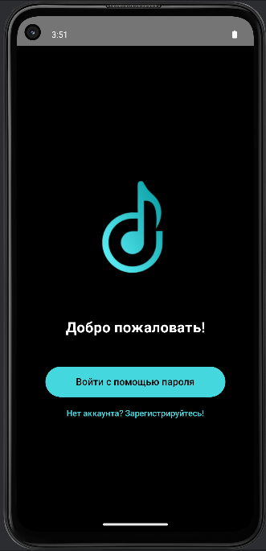
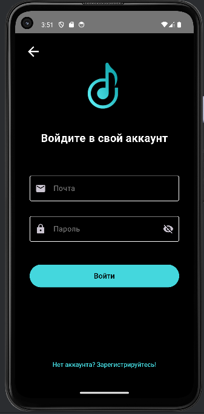
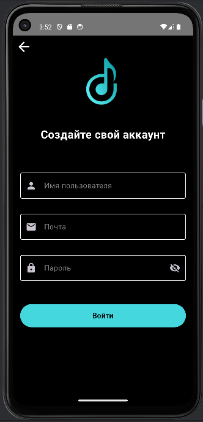
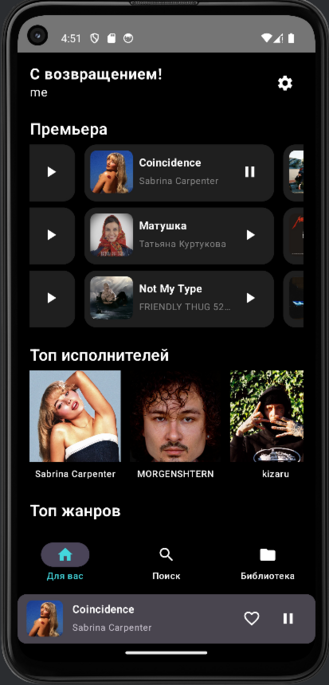
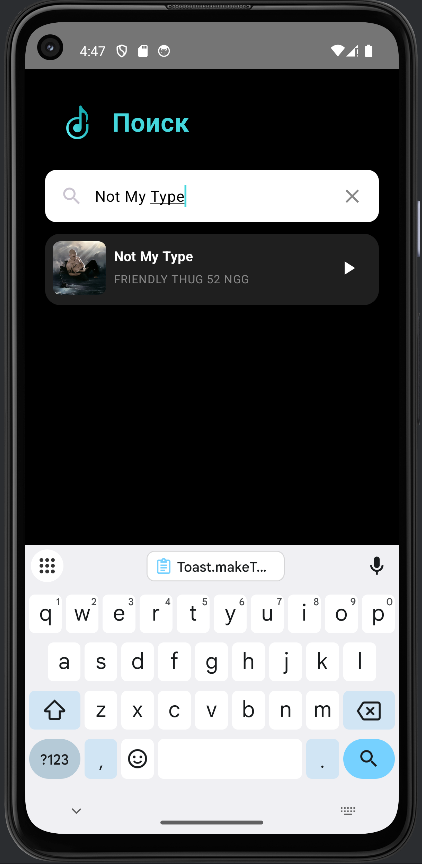

# 🎵 Музыкальное приложение

Клиент-серверное музыкальное приложение на **Kotlin + Jetpack Compose** с сервером на **Ktor** и базой данных **PostgreSQL**.  
Приложение позволяет слушать музыку, просматривать новинки, искать треки, сохранять их в избранное и пользоваться полноэкранным плеером.

---

## 📸 Скриншоты
Экран приветствия:

Экран входа (если уже регистрировались):

Экран регистрации: 

Главный экран:

Экран поиска песен:

Экран избранных песен:

---

## 🎬 Видео демонстрация

---

## ✨ Основной функционал
- 🆕 Раздел «Премьера» — новые треки  
- 🧑‍🎤 Топ артистов  
- 🏷️ Категории по жанрам  
- 🔎 Поиск песен по базе данных  
- ⭐ Добавление треков в избранное  
- 🎧 Полноэкранный музыкальный плеер с переключением треков  

---

## 🛠 Технологии
- **Клиент**: Kotlin, Jetpack Compose, Material 3, MVVM, Coroutines, Navigation  
- **Сервер**: Ktor, PostgreSQL  
- **Архитектура**: Client–Server, REST API  

---
